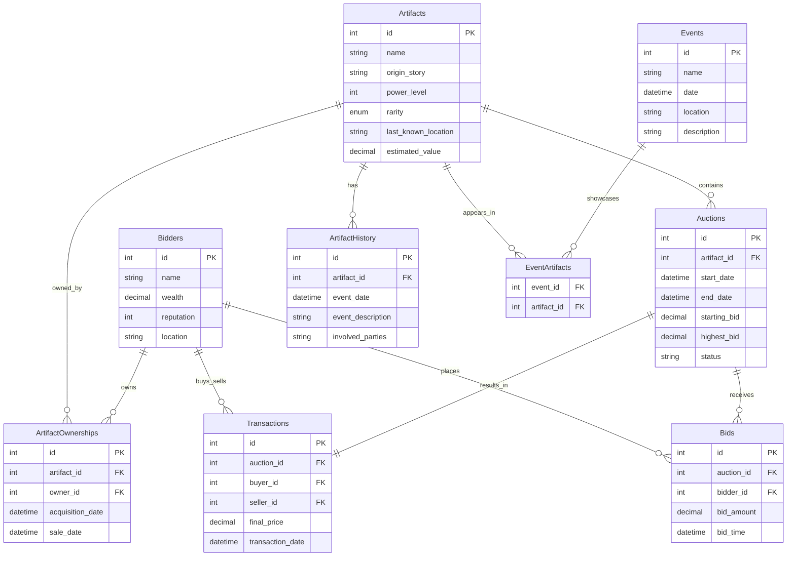

# Three Tier Postgres

A project with a domain revolving 'Artifact Auction' where various fictional items are sold off to bidders.

## Architecture

### Tier 1: TBD

### Tier 2: C# .net API

API responsible for handling requests and pass data between the third layer using gRPC client to serialize and de-serialize messages.

### Tier 3: Java Maven Datalayer

Recieves requests from the gRPC client on tier 2 which are processed and interact with a postgres database using DAO pattern.
The gRPC server utilizes connection pooling for efficiency, scalability and control.

### Entity Relationships

